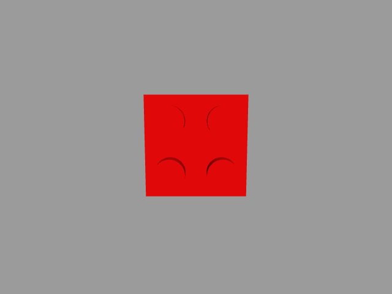

# myPalletizer 260 Pi + adaptive gripper + D435 simulation

ROS 2 Galactic / Gazebo Classic simulator for Windows 11 with Docker Desktop. The robot and gripper geometry comes from [Elephant Robotics' Galactic ROS 2 repository](https://github.com/elephantrobotics/mycobot_ros2/tree/galactic) at commit `83d4d10db552edf8940e4d79bec186aeaa880b4a`. The supplied LEGO program and `best.pt` are included under `legacy/`.

## Current scope

- Pi arm model, adaptive gripper, camera mount, and one red 2×2 Duplo sized block in Gazebo.
- A virtual leveling joint follows shoulder plus elbow motion so the gripper's tool axis stays downward while the arm moves. The fourth exposed myPalletizer joint still rotates the gripper about that vertical axis.
- ROS 2 trajectory control for arm and gripper. A TCP server on port 9000 accepts the `MyPalletizerSocket` commands used by the provided code: joint and Cartesian motion, angle and coordinate reads, moving state, and gripper commands.
- Gazebo depth camera publishes color and depth ROS images. A probe runs the supplied YOLO model against a frame.
- Browser based Gazebo desktop at `http://localhost:6080/vnc.html`.



The camera is a simulated depth camera shaped and placed like the D435. It does not emulate RealSense hardware. `legacy/sim_realsense.py` adapts ROS color and depth images to the small part of the `pyrealsense2` API used by `legacy/camera_controller.py`; `SIM_CAMERA=1` activates it. `legacy/main.py` completes its motion sequence in the current simulation, but the brick does not attach to the gripper. YOLO detections on the simplified block are not guaranteed; real photos and simulated rendering differ. The socket bridge's Cartesian IK and camera mount are provisional and require calibration against the real setup. Masses are placeholder values.
The first stage disables robot collision meshes and gravity because the vendor meshes overlap in Gazebo with placeholder inertias. This permits arm and sensor following but does not yet support a physically valid Duplo grasp.

## Start on Windows 11

1. Start Docker Desktop using Linux containers. Allocate at least 8 GB RAM. The first build downloads ROS and Python dependencies and can take time. The image is about 10 GB on this Windows host; if C: is tight, move Docker Desktop's disk image to a drive with more space in Settings → Resources → Advanced before rebuilding.
2. In PowerShell, in this repository:

   ```powershell
   docker compose up --build
   ```

3. Open `http://localhost:6080/vnc.html`. Software rendering is enabled for broad Windows compatibility.
4. In another PowerShell window, check ROS topics and controllers:

   ```powershell
   docker compose exec sim bash -lc 'source /opt/ros/galactic/setup.bash && ros2 node list | grep controller_manager'
   docker compose exec sim bash -lc 'source /opt/ros/galactic/setup.bash && ros2 topic list'
   ```

5. Test movement and gripper, then color/depth and YOLO:

   ```powershell
   docker compose exec sim bash -lc 'source /opt/ros/galactic/setup.bash && python3 scripts/probe_motion.py'
   docker compose exec sim bash -lc 'source /opt/ros/galactic/setup.bash && python3 scripts/probe_gripper.py'
   docker compose exec sim bash -lc 'source /opt/ros/galactic/setup.bash && python3 scripts/probe_follow.py'
   docker compose exec sim bash -lc 'source /opt/ros/galactic/setup.bash && python3 scripts/probe_level.py'
   docker compose exec sim bash -lc 'source /opt/ros/galactic/setup.bash && python3 scripts/probe_search.py'
   docker compose exec sim bash -lc 'source /opt/ros/galactic/setup.bash && python3 scripts/probe_vision.py'
   docker compose cp sim:/opt/sim/camera_sample.png .\camera_sample.png
   ```

The simulator TCP endpoint is `127.0.0.1:9000` from Windows, or `127.0.0.1:9000` inside the container. Change the IP in a copy of your code when testing the simulator. Keep the real robot disconnected during first tests.

After the probes, try the copied program with `docker compose exec sim bash -lc 'source /opt/ros/galactic/setup.bash && python3 legacy/main.py'`. The simulator adapter uses the same YOLO weights and visual servo code. Inspect the model pose, depth topics, and geometry before treating a pick result as valid.

In simulation, `legacy/main.py` checks whether the search pose was actually reached. While looking for a block it reports whether YOLO or the red contour failed, sweeps the base joint through ±20° when no target appears, and stops with a clear error after 45 seconds. If it cannot find the block, copy `/opt/sim/search_failure.png` out of the container with `docker compose cp sim:/opt/sim/search_failure.png .\search_failure.png`. This simulated sweep is disabled when `SIM_CAMERA` is not `1`. The simulated visual servo limits each Cartesian correction to 8 mm and reports a stalled arm instead of looping forever. Its simulated tool height is 40 mm; the original 160 mm real-robot value is preserved for non-simulation runs.

## Source and model notes

`scripts/build_robot.py` converts the vendor URDF to `urdf/robot.urdf`, adds Gazebo control, a virtual leveling joint, estimated inertias, and a D435 mount based on the offsets in `legacy/config.py` (75, 38, 40 mm and 8° pitch). The virtual joint is commanded as shoulder angle plus elbow angle by `scripts/socket_bridge.py` to model the real arm's downward tool linkage. This leveling applies to motion sent through the pymycobot socket bridge; direct ROS trajectory commands must also command `wrist_level_joint`. Measure the camera transform before relying on precise grasp coordinates. The original URDF and meshes are kept for comparison. The vendor package license is in `VENDOR_LICENSE.txt`.

## Verification on Windows 11 / Docker Desktop

- `docker compose up -d --build` started Gazebo, the robot, both controllers, and the browser GUI (`/vnc.html` returned HTTP 200).
- `probe_motion.py` moved to approximately `[19.72, 19.72, -19.72, 14.79]` degrees for a `[20, 20, -20, 15]` degree command and returned close to zero.
- `probe_gripper.py` measured 0.15 rad open and -0.45 rad closed. `probe_follow.py` measured 0.138 m camera travel with the arm.
- `probe_level.py` measured 0.47° tool tilt from vertical at home and at two different arm poses, including a 45° wrist rotation.
- The LEGO world pose is `(0.19, -0.075, 0.0096)` m. At the search pose its red contour center was approximately `(319.5, 236.3)` pixels against an image center of `(320, 240)`. `probe_vision.py` received 640×480 color and float32 depth images and detected `LEGO_2_2` with 0.82 confidence.
- `legacy/main.py` loaded YOLO, moved to search, detected the brick, centered it, aligned and rotated the gripper, descended to approximately 157 mm, issued a lift to approximately 257 mm, and returned home without an exception. The camera offsets, IK, and tool height are provisional; the robot has no collision geometry for physical grasping.

ROS 2 Galactic and Gazebo Classic are end of life; this version matches the existing program rather than updating its ROS environment.
